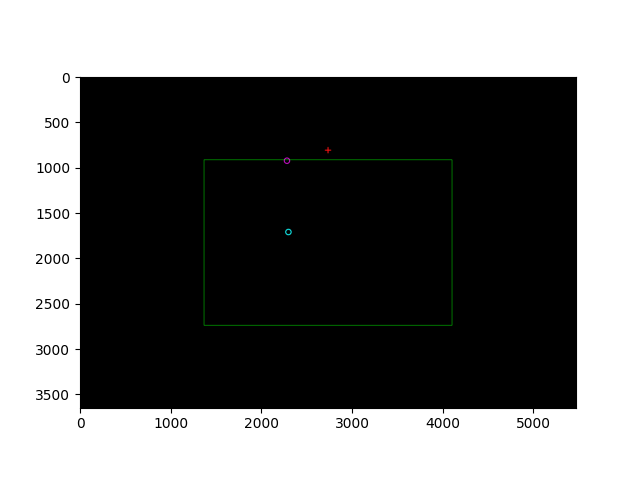
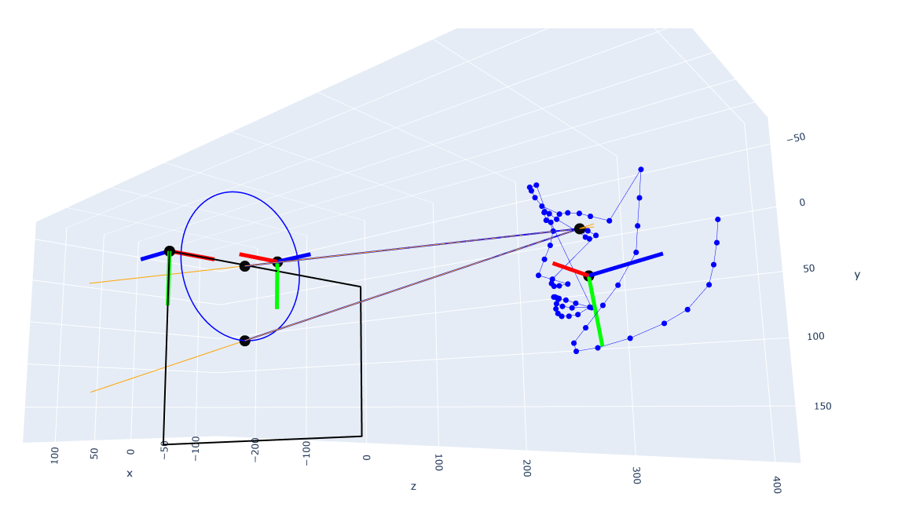

# ReCalib: A Multi-Session Gaze Dataset for Calibration Robustness and User Adaptation

This repository is the official companion to the **ReCalib** dataset paper. ReCalib is a longitudinal eye-tracking dataset designed to facilitate research on **calibration robustness** and **user-specific personalization** in camera-based gaze estimation. Captured using a Microsoft Surface Pro 7+, the dataset includes over 150,000 images from 9 participants across 188 sessions.

"Public gaze estimation datasets have largely focused on increasing scale and variability in gaze direction, head pose, illumination, and user appearance to improve cross-user generalization. However, datasets explicitly structured to support calibration analysis and user-specific adaptation remain limited. We present ReCalib, a longitudinal eye-tracking dataset designed to facilitate research on calibration robustness and personalization in camera-based gaze estimation systems. The dataset contains recordings from nine participants acquired across multiple sessions and days under realistic human–computer interaction and assistive communication scenarios. Each session follows a structured protocol consisting of a 9-point calibration task followed by several independent 16-point test tasks, enabling explicit separation between calibration and evaluation both within and across sessions. In total, the dataset includes more than 150,000 frontal RGB images captured using a single acquisition setup. Each sample is annotated with screen target coordinates, head pose estimates, selected facial landmarks, eye-region geometry, and a 3D gaze vector representation expressed in a camera-centered coordinate system. In addition, per-sample quality flags derived from a post-acquisition filtering process are provided to support reproducible data selection. The dataset enables studies on domain adaptation, user personalization, and session-level recalibration in gaze estimation systems."

---

## 🔗 Links
* **Paper:** [Insert Journal Link/DOI]
* **Dataset (DOI):** [https://doi.org/10.5281/zenodo.XXXXXXX](https://doi.org/10.5281/zenodo.XXXXXXX)
* **Code DOI:** [Insert Code DOI if minted]

---

## 📊 Dataset Structure & Access

The **ReCalib** dataset is organized hierarchically to facilitate multi-session and longitudinal analysisEach participant is assigned a top-level directory, with data grouped into independent recording sessions conducted on different days.

### Recommended Directory Layout
To ensure compatibility with the provided scripts, organize the downloaded data as follows:

```text
ReCalib/
├── user_00/                            # Unique participant identifier
│   ├── session_00_00/                  # Independent recording session
│   │   ├── task_00_00_00/              # 9-point calibration task
│   │   │   ├── 00_00_00_img-0001.jpg   # Frontal RGB image
│   │   │   └── 00_00_00_img-0001.json  # Per-sample annotation file
│   │   └── task_00_00_01/              # 16-point test task
│   │       ├── 00_00_01_img-0001.jpg
│   │       └── 00_00_01_img-0001.json
│   │   └── task_00_00_02/
...
├── user_01/                      
│   ├── session_01_00/                
...
└── recalib_index.csv                   # Companion index listing all samples and metadata
```

---

## 📝 Annotation Format

Each image in the ReCalib dataset is paired with a comprehensive JSON annotation file. To ensure geometric consistency, all 2D quantities (such as target positions and landmarks) are expressed in **pixels**, while all 3D quantities are expressed in **millimeters (mm)** within a camera-centered coordinate system.

### Key Annotation Fields

The following fields are included in each sample's JSON file to support model training and technical validation:

* **`hpe.6d`**: A 6-dimensional representation of head pose $(r_x, r_y, r_z, t_x, t_y, t_z)$. Rotations are Euler angles in radians, and translations are in millimeters.
* **`gaze.vector`**: A unit-norm 3D gaze direction vector representing the user's gaze.
* **`gaze.intersection`**: The 3D intersection point where the gaze ray meets the screen plane, expressed in millimeters.
* **`gaze.origin`**: The 3D origin of the gaze ray, located between the eyes.
* **`discard_info`**: Records the specific reason for sample exclusion (e.g., failed face detection, geometrically inconsistent, or closed eyes) if flagged by the quality pipeline.
* **`pos.x, pos.y`**: The 2D screen target coordinates in pixels, defining the ground truth for the visual stimulus.
* **`hpe.facial_landmarks_2D`**: Selected 2D facial landmarks used by the MediaPipe Face Mesh model.
* **`eye_roi`**: Inner and outer eye corner coordinates for each eye.

### Metadata & Geometry

While per-sample JSONs contain specific coordinates, global acquisition metadata—such as device specifications, screen dimensions, and camera placement—remain constant across the dataset. Detailed technical specifications for the acquisition environment can be found in the `docs/` folder:

* **`camera_intrinsics.npz`**: Contains the specific camera intrinsic parameters ($f_x, f_y, c_x, c_y$) and distortion coefficients used for geometric gaze mapping.
* **`setup_config.json`**: Provides the physical setup dimensions, including the spatial relationship between the camera and the display.

---

## 🧠 Usage Notes & Evaluation Scenarios

ReCalib is specifically designed to support multiple levels of adaptation research. Its hierarchical organization (User > Session > Task) allows for the definition of rigorous evaluation protocols that mimic real-world HCI and AAC (Augmentative and Alternative Communication) deployments.

### Supported Research Scenarios

1. **Cross-Dataset Transfer**
   Evaluate a model trained on external datasets (like ETH-XGaze or GazeCapture) directly on ReCalib. This helps quantify the "domain gap" between general gaze datasets and specific tablet-based interaction scenarios.

2. **Cross-User Adaptation**
   Standard participant-independent evaluation. Use a "leave-one-user-out" protocol to ensure the model generalizes to completely unseen facial geometries and appearances.

3. **User Personalization**
   Leverage the multi-session nature of the dataset. Use samples from a participant's earlier sessions for fine-tuning/adaptation, and evaluate on their subsequent, held-out sessions to study longitudinal performance.

4. **Session-Level Calibration**
   The most realistic scenario for AAC systems: 
   * **Train:** Use only the 9-point calibration task at the start of a session.
   * **Evaluate:** Test on the 16-point tasks that followed in that same session.

### ⚠️ Data Leakage Prevention

To maintain the integrity of your results, please follow these rules:
* **Subject Independence:** Never include images of the test participant in the training/calibration set during cross-user experiments.
* **Temporal Separation:** For session-level evaluation, always use the calibration task as the adaptation source and the test tasks for evaluation to respect the chronological flow of a real interaction.
* **Filtering:** We recommend using the provided `discard_info` flags to exclude blinks and failed detections to ensure baseline consistency.

---

## 📂 Repository Contents
This repository provides the tools necessary to parse, visualize, and evaluate the ReCalib dataset:
* `examples/`: Sample for visualization/understanding of the dataset.
* `visualization/`: Core visualization tools for 2D/3D gaze and landmark inspection.
* `evaluation/`: Scripts for ETH-XGaze baseline fine-tuning and cross-user evaluation.
* `docs/`: Detailed documentation on the annotation schema and hardware setup.

---

## 👁️ Visualization

The `visualization/` directory provides tools to inspect the dataset's geometric annotations and verify model performance through 3D interactive and 2D overlays.

## `visualize_sample.py`
This is the main utility for data inspection. It supports both ground-truth visualization and inference verification.

* **2D Inspection**: Generates a 2D image overlay in the screen coordinate system and an interactive 3D visualization of the gaze origin, vector, and head pose.
* **Label Verification**: Renders all JSON metadata, including facial landmarks, eye ROIs, and 3D gaze rays.
* **Inference Overlay**: Optionally accepts a path to a trained model from the `evaluation/` section to compare predicted gaze vectors against ground-truth labels.
* **Input**: Requires the absolute or relative path to a single `.png` sample.
* **Output**: 
    * **Interactive 3D Plot**: A spatial representation of the camera-centered coordinate system.
    * **2D Screen View**: Target and gaze intersection points mapped to the 2D display.
    * **Metrics**: Real-time calculation of angular error (in degrees) if a model is provided.


Below are examples of the outputs generated by `visualize_sample.py`:

| 2D Screen Coordinate View | 3D Camera-Centered View |
| :---: | :---: |
|  |  |
| *Overlay of PoG on the screen.* | *Interactive 3D representation of the gaze vector and al the elements.* |

---

## ⚖️ Evaluation Framework

The `evaluation/` directory contains the core pipeline for preparing data and benchmarking gaze estimation models on ReCalib. 

### Baseline Model
Our evaluation scripts are built to interface with the **ETH-XGaze** architecture. We utilize the officially released model as a reproducible reference point for any benchmark.
* **Official Repository:** [xucong-zhang/ETH-XGaze](https://github.com/xucong-zhang/ETH-XGaze)
* **Reference:** Zhang et al., "ETH-XGaze: A Large Scale Dataset for Gaze Estimation Under Extreme Head Pose and Gaze Variation," ECCV 2020.

### Scripts Overview

1. **`data_normalization.py`**
   Converts raw images and JSON annotations into processed HDF5 (`.h5`) files.
   * **Normalization:** Implements the spatial normalization manifold from the ETH-XGaze repository.
   * **Usage:** Requires the `input_folder` variable to be set to the local path of the ReCalib dataset.
   * **Output:** Generates compressed HDF5 files containing normalized images, head pose, and 3D gaze vectors.

2. **`train_model.py`**
   The primary script for model training, fine-tuning, and evaluation. Instead of command-line arguments, this script is configured via an internal `CONFIG_VARS` dictionary to support different adaptation scenarios.

### Configuration & Scenarios

To switch between the evaluation protocols described in the paper (e.g., Cross-User vs. Session-Calibration), modify the `CONFIG_VARS` in `train_model.py`:

```python
CONFIG_VARS = {
    "target_user": "01",         # Participant ID for evaluation
    "target_session": "00",      # Set to None for Cross-User (Leave-One-User-Out) protocols
    "session_calibration": True, # True: uses the 9-point calibration subset; False: uses test subset
    "batch_size": 32,
    "epochs": 5,
    "ckpt_dir": "./checkpoints",
}
```
---

## 🛠 Installation

**Requirements:** Python 3.8+.  

```bash
git clone https://github.com/agarciadelasanta/ReCalib-Longitudinal-gaze-estimation-dataset-for-calibration-robustness-and-user-personalization.git
cd ReCalib
pip install -r requirements.txt
```
---


## 📜 Citation

If you use the ReCalib dataset, annotations, or code in your research, please cite the following paper:

```bibtex
@article{recalib2026,
  title={Longitudinal gaze estimation dataset for calibration robustness and user-specific personalization},
  author={Garcia de la Santa, Alejandro and Perona, Iñigo and Jodra, Jose Luis and Villanueva, Arantxa},
  journal={Scientific Data},
  year={2026},
  doi={10.5281/zenodo.XXXXXXX}
}
```

---

## ⚖️ License


Code: MIT License.

Data: Creative Commons Attribution 4.0 International (CC BY 4.0).

---

## ✉️ Contact

For questions regarding reproducibility or dataset access, please open an issue in this repository or contact the main author directly:
a.garcia@irisbond.com