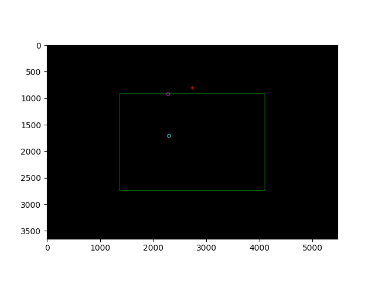
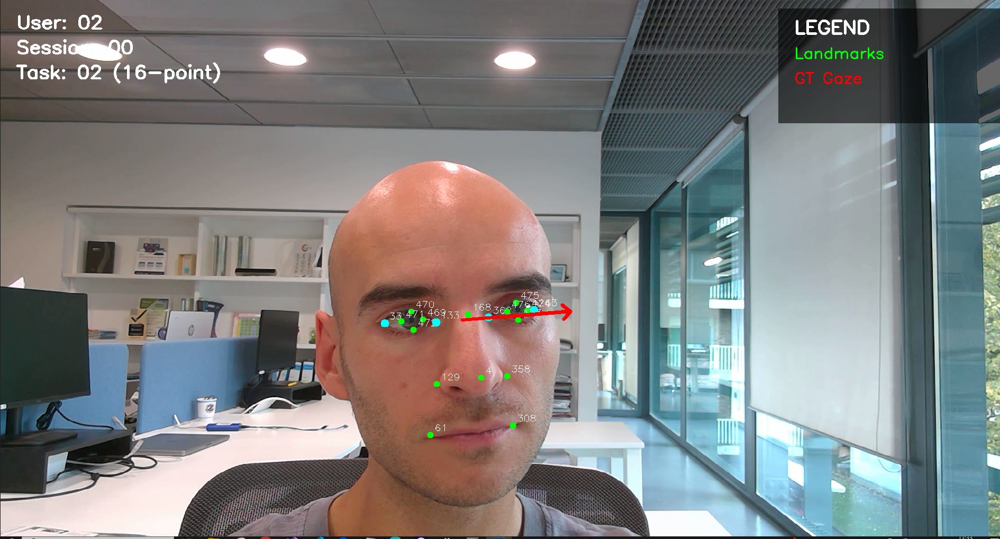
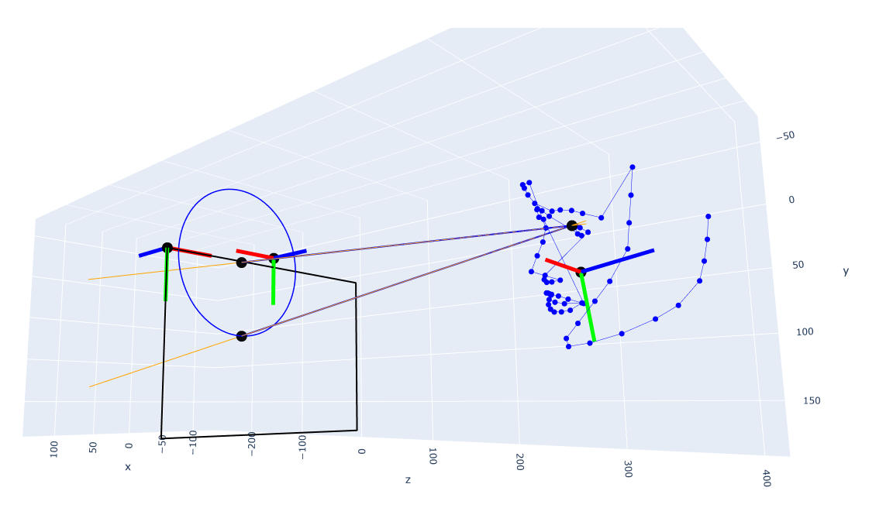
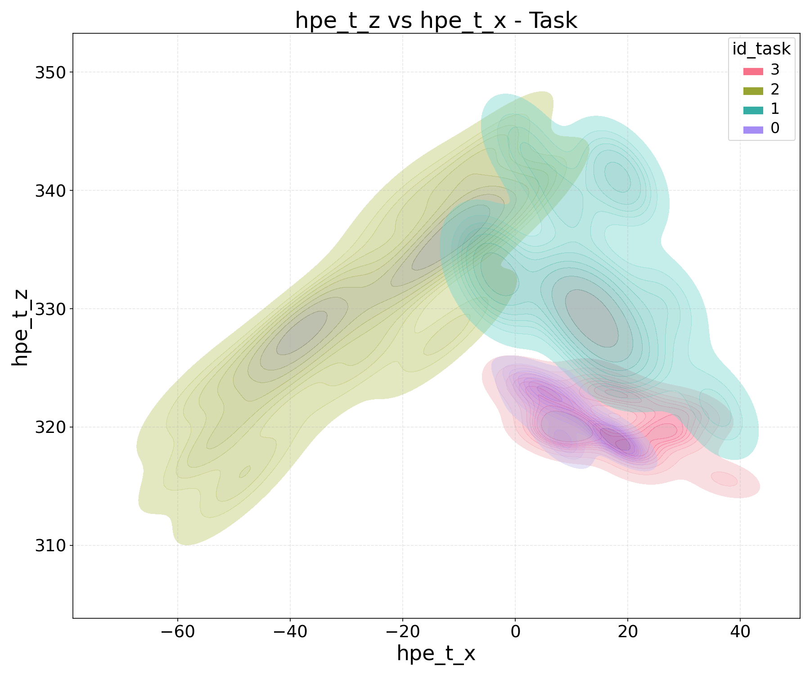
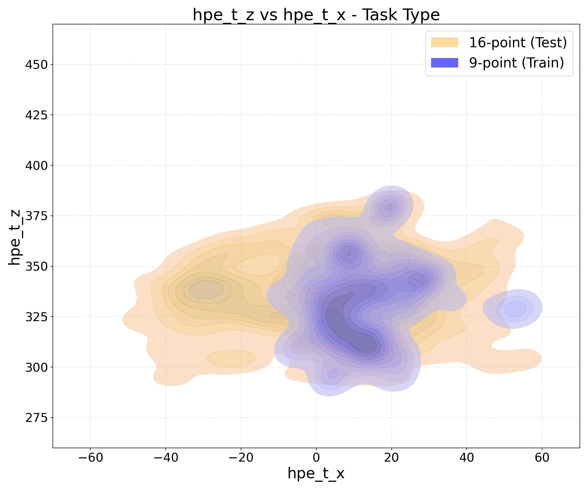
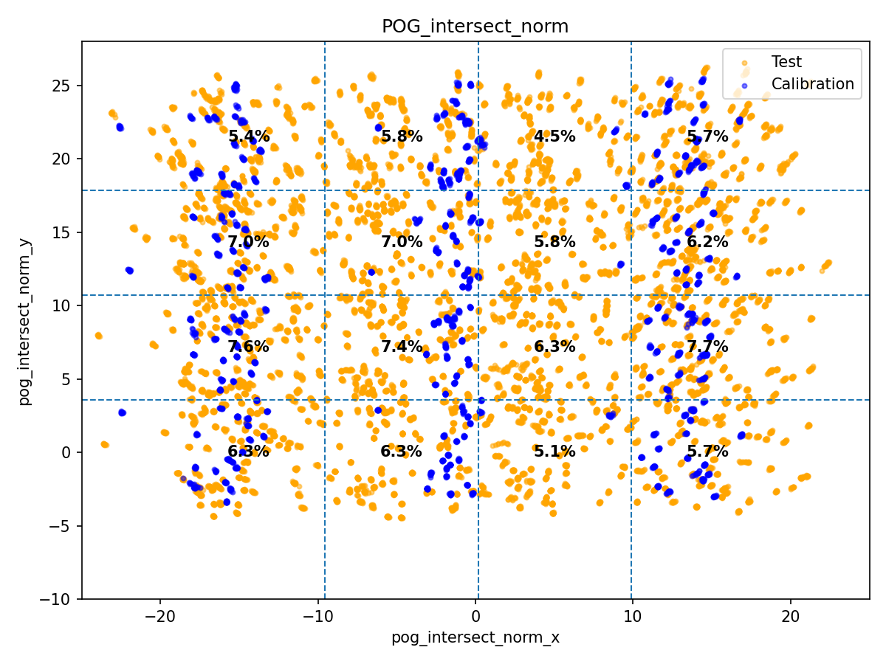

# ReCalib: Longitudinal gaze estimation dataset for calibration robustness and user-specific personalization

This repository is the official companion to the **ReCalib** dataset paper. ReCalib is a longitudinal eye-tracking dataset designed to facilitate research on **calibration robustness** and **user-specific personalization** in camera-based gaze estimation. Captured using a Microsoft Surface Pro 7+, the dataset includes over 150,000 images from 9 participants across 188 sessions.

"Gaze estimation datasets have traditionally focused on increasing variability in gaze direction, head pose, illumination, and user appearance in order to improve cross-user generalization. However, datasets explicitly structured to support calibration analysis and user personalization remain limited. We present ReCalib, a longitudinal eye-tracking dataset designed to facilitate research on calibration robustness and personalization in webcam-based gaze estimation systems. The dataset contains recordings from nine participants acquired across 188 sessions under realistic assistive communication scenarios, resulting in approximately 150,000 images. Each session follows a structured protocol consisting of a 9-point calibration task followed by several independent 16-point test tasks, enabling a clear separation between calibration and evaluation phases. Each sample is annotated with screen target coordinates, head pose estimates, key facial landmarks, and a 3D gaze vector. The dataset supports research on domain adaptation, user personalization, and session-level recalibration in gaze estimation systems."

**Keywords:** Gaze Estimation, Eye-Tracking, Assistive Alternative Communication, Computer Vision, Dataset, HCI.

---

### 👥 Authorship & Affiliations
| Name | Institutional Affiliation | ORCID |
| :--- | :--- | :--- |
| **Alejandro García de la Santa Ramos** | University of the Basque Country (UPV/EHU) / Irisbond | [0000-0002-1357-6135](https://orcid.org/0000-0002-1357-6135) |
| **Ane Zulaika** | Irisbond Crowdbonding SL, Donostia, Spain | [0009-0004-3277-8033](https://orcid.org/0009-0004-3277-8033) |
| **Iñigo Perona** | University of the Basque Country (UPV/EHU) | [0000-0002-9246-3736](https://orcid.org/0000-0002-9246-3736) |
| **Jose Luis Jodra** | University of the Basque Country (UPV/EHU) | [0000-0003-2453-9521](https://orcid.org/0000-0003-2453-9521) |
| **Arantxa Villanueva** | Public University of Navarre (UPNA), Pamplona, Spain | [0000-0001-9822-2530](https://orcid.org/0000-0001-9822-2530) |

* **Dataset Contact:** Alejandro García de la Santa Ramos (agarciadelasan001@ikasle.ehu.eus)
---

## 🔗 Links
* **Dataset Repository (DOI):** [https://doi.org/10.82518/A0TND2](https://doi.org/10.82518/A0TND2)

---

## 🛠 Installation

**Requirements:** Python 3.10.15+.

For the bundled example and dataset-summary visualizations:

```bash
git clone https://github.com/agarciadelasanta/ReCalib-A-multi-session-gaze-dataset-for-calibration-robustness-and-user-adaptation.git ReCalib
cd ReCalib
python -m pip install -r requirements-visualization.txt
```

Install `requirements.txt` instead when you also need ETH-XGaze inference,
training, or evaluation. The two visualization scripts resolve their bundled
data and configuration paths from the repository, so they do not depend on
the directory from which they are launched.

---

## 📊 Dataset Structure & Access

The **ReCalib** dataset is organized hierarchically to facilitate multi-session and longitudinal analysisEach participant is assigned a top-level directory, with data grouped into independent recording sessions conducted on different days.

### Recommended Directory Layout
To ensure compatibility with the provided scripts, organize the downloaded data as follows:

```text
ReCalib/
├── user_00/                            # Unique participant identifier
│   ├── session_00_00/                  # Independent recording session
│   │   ├── task_00_00_00/              # 9-point calibration task
│   │   │   ├── 00_00_00_img-0001.jpg   # Frontal RGB image
│   │   │   └── 00_00_00_img-0001.json  # Per-sample annotation file
...
│   │   └── task_00_00_01/              # 16-point test task
│   │       ├── 00_00_01_img-0001.jpg
│   │       └── 00_00_01_img-0001.json
...
│   │   └── task_00_00_02/
...
├── user_01/                      
│   ├── session_01_00/                
...
└── recalib_index.csv                   # Companion index listing all samples and metadata
```

---

## 📝 Annotation Format

Each image in the ReCalib dataset is paired with a comprehensive JSON annotation file. To ensure geometric consistency, all 2D quantities (such as target positions and landmarks) are expressed in **pixels (px)**, while all 3D quantities are expressed in **millimeters (mm)** within a camera-centered coordinate system.

### Key Annotation Fields

The following fields are included in each sample's JSON file to support model training and technical validation:

* **`pog_px`**: The 2D screen target coordinates (`x`, `y`) in pixels, defining the ground truth for the visual stimulus.
* **`gaze`**: Information regarding the totality of the elements that form the gaze in 3D space, including the `vector` (direction), `origin_mm` (starting point between the eyes), and `pog_mm` (Point of Gaze intersection on the screen plane).
* **`head_pose.rotation_rad`**: A 3-dimensional representation of head pose rotation as Euler angles in radians $(r_x, r_y, r_z)$.
* **`head_pose.translation_mm`**: A 3-dimensional representation of head pose translation in millimeters $(t_x, t_y, t_z)$.
* **`head_pose.mediapipe_face_mesh_2d`**: Key 2D facial landmarks used by the MediaPipe Face Mesh model. See `docs/mediapipe_face_landmark.png` for a detailed explanation of each landmark index. 
* **`quality_assurance_metrics`**: Raw quality metrics calculated during post-processing used to evaluate face detection confidence, head pose geometric consistency, and eye visibility.  
* **`discard_info`**: Records the specific categorical reason for sample exclusion if flagged by the quality pipeline. See `docs/discarding_criteria.py` for an explanation for each discarding criteria category.

### Metadata & Geometry

While per-sample JSONs contain specific coordinates, global acquisition metadata—such as device specifications, screen dimensions, and camera placement—remain constant across the dataset. Detailed technical specifications for the acquisition environment can be found in the `docs/` folder:

* **`camera_intrinsics.npz`**: Contains the specific camera intrinsic parameters ($f_x, f_y, c_x, c_y$) and distortion coefficients used for geometric gaze mapping.
* **`setup_config.json`**: Provides the physical/virtual setup dimensions, including the spatial relationship between the camera and the display.

---

## 🧠 Usage Notes & Evaluation Scenarios

ReCalib is specifically designed to support multiple levels of adaptation research. Its hierarchical organization (User > Session > Task) allows for the definition of rigorous evaluation protocols that mimic real-world HCI and AAC (Augmentative and Alternative Communication) deployments.

### Supported Research Scenarios

1. **Cross-Dataset Transfer**
   Evaluate a model trained on external datasets directly on ReCalib. This helps quantify the "domain gap" between general gaze datasets and this specific tablet-based interaction scenario.

2. **Cross-User Adaptation**
   Standard participant-independent evaluation. Use a "leave-one-user-out" protocol to ensure the model generalizes to completely unseen facial geometries and appearances.

3. **User Personalization**
   Leverage the multi-session nature of the dataset. Use samples from a participant's earlier sessions for fine-tuning/adaptation, and evaluate on their subsequent, held-out sessions to study longitudinal performance.

4. **Session-Level Calibration**
   The most realistic scenario for AAC systems: 
   * **Train:** Use the 9-point calibration task at the start of a session.
   * **Evaluate:** Test on the 16-point tasks that followed in that same session.

### ⚠️ Data Leakage Prevention

To maintain the integrity of your results, please follow these rules:
* **Subject Independence:** Never include images of the test participant in the training/calibration set during cross-user experiments.
* **Temporal Separation:** For session-level evaluation, always use the calibration task as the adaptation source and the test tasks for evaluation to respect the chronological flow of a real interaction.
* **Filtering:** We recommend using the provided `discard_info` flags to exclude blinks and failed detections to ensure baseline consistency.

---

## 📂 Repository Contents
This repository provides the tools necessary to parse, visualize, and evaluate the ReCalib dataset:
* `example/`: Bundled image/JSON pair for visualization and schema inspection.
* `dataset_summary.csv`: Bundled flattened index used by the distribution visualizer.
* `visualization/`: Core visualization tools for sample distribution, 2D/3D gaze and landmark inspection.
* `evaluation/`: Scripts for ETH-XGaze baseline fine-tuning and cross-user evaluation.
* `docs/`: Detailed documentation on the annotation schema and hardware setup.

---

## 👁️ Visualization

The `visualization/` directory provides tools to inspect the dataset's geometric annotations and verify model performance through 3D interactive and 2D overlays.

### `explore_dataset.py`

This is the recommended starting point for understanding the dataset. It
generates a self-contained interactive HTML report from the bundled
`dataset_summary.csv`, without requiring the restricted image dataset.

The report provides cascading participant, session, task, and quality filters;
exact sample and acceptance counts; longitudinal session coverage; task and
discard-reason summaries; sampled head-pose coverage; screen-target density;
and a per-session breakdown.

```bash
# Generate temp/recalib_dataset_explorer.html
python visualization/explore_dataset.py

# Generate it and open it in the default browser
python visualization/explore_dataset.py --open

# Start on one participant/session and choose another output path
python visualization/explore_dataset.py --id-user 7 --id-session 13 --output results/explorer.html
```

Interactive continuous plots use a deterministic sample to keep the report
responsive, while all displayed counts remain exact. Run
`python visualization/explore_dataset.py --help` for CSV, initial-filter,
output, sampling, and browser options.

## `visualize_sample.py`
This is the main utility for data inspection. It supports both ground-truth visualization and inference verification.

* **2D Inspection**: Generates a 2D image overlay in the screen coordinate system and an interactive 3D visualization of the gaze origin, vector, and head pose.
* **Label Verification**: Renders all JSON metadata, including facial landmarks, eye ROIs, and 3D gaze rays.
* **Inference Overlay**: Optionally accepts an ETH-XGaze checkpoint to compare predicted gaze vectors against ground-truth labels. Inference is disabled by default, so the bundled example does not require `dlib`, PyTorch, or a downloaded checkpoint.
* **Input**: Uses `example/07_00_02_img-040.png` by default, or accepts an absolute or relative path to a `.png`/`.jpg` sample with a same-named `.json` file.
* **Output**: 
    * **Interactive 3D**: A spatial representation of the camera-centered coordinate system.
    * **2D Screen**: Target and gaze intersection points mapped to the 2D display.
    * **Image overlay**: Visualization of the gaze vector and 2D landmarks over the original image.
    * **Metrics**: Real-time calculation of angular error (in degrees) if a model is provided.

Launch the bundled example from the repository root:

```bash
python visualization/visualize_sample.py
```

Close each interactive window to advance to the next view. To inspect another
sample or perform a noninteractive validation:

```bash
python visualization/visualize_sample.py path/to/sample.png
python visualization/visualize_sample.py --no-display
```

ETH-XGaze inference is optional because the large pretrained checkpoint is not
stored in Git. Install the full requirements, download the checkpoint linked
in `evaluation/ckpt/readme.txt`, and pass it explicitly:

```bash
python -m pip install -r requirements.txt
python visualization/visualize_sample.py --checkpoint evaluation/ckpt/epoch_24_ckpt.pth.tar
```

Run `python visualization/visualize_sample.py --help` for model-path,
camera-intrinsics, setup-config, and device overrides.

Below are examples of the outputs generated by `visualize_sample.py`:

| 2D Screen View | Image overlay view | Interactive 3D View |
| :---: | :---: | :---: |
|  |  |  |
| *Representation of PoG on the screen.* | *Overlay od different labels over the oringal image.* | *Interactive 3D representation of the gaze vector and al the elements.* |

### `main_gaze_visualization.py`
This script analyzes and visualizes the distribution of gaze and head pose parameters across the dataset, allowing for targeted inspection of specific subsets.

* **Distribution Analysis**: Generates comprehensive plots performing different comparisons: calibration (9-point) versus test (16-point) tasks, valibration tasks across all session of a user and different tasks over a specific user + session.
* **Visual Outputs**: Produces histograms, KDE (Kernel Density Estimation) heatmaps, and scatter plots overlaying the screen grid for variables like HPE, gaze vectors, and gaze intersections.
* **Input**: Uses the bundled `dataset_summary.csv` and analyzes participant 7 by default. CLI options can select another participant, session, task, CSV, or plotting-parameter YAML.
* **Output**: Displays the generated figures interactively and exports them as `.png` images under `temp/`, along with a filtered augmented CSV.

Launch the default analysis:

```bash
python visualization/main_gaze_visualization.py
```

Examples of common configurations:

```bash
# One session and task
python visualization/main_gaze_visualization.py --id-user 7 --id-session 13 --id-task 0

# All participants, without plots or exported files
python visualization/main_gaze_visualization.py --all-users --no-plots --no-export

# A custom summary and export directory
python visualization/main_gaze_visualization.py --csv path/to/summary.csv --export-dir results
```

Run `python visualization/main_gaze_visualization.py --help` for all filtering,
grid, outlier, delimiter, plotting, and export options.

Below some of the many possible outputs generated by `main_gaze_visualization.py`:
| Task: `hpe_t_z` vs. `hpe_t_x` | Session: `hpe_t_z` vs. `hpe_t_x` | User Normalized PoG |
| :---: | :---: | :---: |
|  |  |  |
| *Distribution of `hpe_t` samples for a single session.* | *Distribution of `hpe_t` samples for a single user.* | *Representation of gaze vector intersections from a static origin.* |

---

## Hierarchical Statistical Comparison

The repository includes a model-independent tool for comparing participants,
sessions, calibration/test distributions, and semantic label families from
`dataset_summary_recalib.csv`. It excludes discarded samples, weights sessions
equally, provides raw and target-conditioned views, and exports continuous
user-by-user KPI matrices with optional session-bootstrap confidence intervals,
session-label permutation tests, and FDR correction.

```bash
python -m statistical_analysis dataset_summary_recalib.csv \
  --output temp/statistical_analysis \
  --bootstrap 0 \
  --permutations 0
```

Generate a self-contained interactive explorer from that report:

```bash
python visualization/explore_statistical_analysis.py \
  --report-dir temp/statistical_analysis \
  --open
```

The explorer plots participant distance matrices, mean distance to peers,
within-participant session instability, calibration/test mismatch, and the
underlying pairwise values. Its filters select the feature family, KPI, task,
raw or target-conditioned view, and estimate or inferential statistic.

See [docs/statistical_analysis.md](docs/statistical_analysis.md) for metric
definitions, the inferential workflow, the output schema, and limitations.

## ⚖️ Evaluation Framework

The `evaluation/` directory contains the core pipeline for preparing data and benchmarking gaze estimation models on ReCalib. 

### Baseline Model
Our evaluation scripts are built based in the **ETH-XGaze** architecture and training scripts. We utilize the officially released model as a reproducible reference point for any benchmark.
* **Official Repository:** [xucong-zhang/ETH-XGaze](https://github.com/xucong-zhang/ETH-XGaze)
* **Reference:** Zhang et al., "ETH-XGaze: A Large Scale Dataset for Gaze Estimation Under Extreme Head Pose and Gaze Variation," ECCV 2020.

### Scripts Overview

1. **`data_normalization.py`**
   Converts raw images and JSON annotations into processed HDF5 (`.h5`) files.
   * **Normalization:** Implements the spatial normalization manifold from the ETH-XGaze repository.
   * **Usage:** Requires the `input_folder` variable to be set to the local path of the ReCalib dataset.
   * **Output:** Generates compressed HDF5 files containing normalized images, head pose, and 3D gaze vectors.

2. **`train_model.py`**
   The primary script for model training, fine-tuning, and evaluation. Instead of command-line arguments, this script is configured via an internal `CONFIG_VARS` dictionary to support different adaptation scenarios.

### Configuration & Scenarios

To switch between the evaluation protocols described in the paper (e.g., Cross-User vs. Session-Calibration), modify the `CONFIG_VARS` in `train_model.py`:

```python
CONFIG_VARS = {
    "target_user": "01",         # Participant ID for evaluation
    "target_session": "00",      # Set to None for Cross-User (Leave-One-User-Out) protocols
    "session_calibration": True, # True: uses the 9-point calibration subset; False: uses all 4 tasks
    "batch_size": 32,
    "epochs": 20,
    "ckpt_dir": "./checkpoints",
}
```
---

## 📜 Citation

If you use the ReCalib dataset, annotations, or code in your research, please cite the following paper:

```bibtex
@article{recalib2026,
  author = {Alejandro Garcia de la Santa Ramos and Ane Zulaika and Iñigo Perona and Jose Luis Jodra and Arantxa Villanueva},
  publisher = {DIPC data repository},
  title = {{Replication Data for: Longitudinal gaze estimation dataset for calibration robustness and user-specific personalization}},
  UNF = {UNF:6:YANxcL38aNOxbL+5Q1dbBQ==},
  year = {2026},
  version = {V1},
  doi = {10.82518/A0TND2},
  url = {https://doi.org/10.82518/A0TND2}
}

```


## Ethics & Consent
* All participants provided informed consent for data collection and sharing for research purposes.
* The study was approved by the **Ethics Committee of the University of the Basque Country (UPV/EHU)** (Approval Code: **PI_2026_022**).


## Data Sensitivity Disclaimer
> **⚠️ Note:** This dataset contains raw biometric human data (unmasked facial images). To protect participant privacy and maintain strict compliance with GDPR and institutional ethical mandates, the complete dataset is shared under a Controlled Access framework. Access is managed manually and requires a verified institutional identity and the acceptance of our formal Data Usage Agreement (DUA).

## 💸 Grant & Funding Information
This dataset was developed with the support of the following research grants:
* **Basque Government:** ADIAN Project & IT1437-22.
* **Basque Government BIKAINTEK:** Grant 027-B2/2023.
* **Spanish Ministry of Science and Innovation (MCIN/AEI/10.13039/501100011033):** Grant PID2021-123087OB-I00, co-funded by the European Regional Development Fund (ERDF) "A way of making Europe".


## ⚖️ License

Code: MIT License.

Complete Restricted Dataset: Governed strictly by the ReCalib Data Usage Agreement (DUA). No standard open Creative Commons license applies to the restricted files due to biometric data protection frameworks.

Open-Access Dataset Sample (recalib_sample.tar): Creative Commons Attribution 4.0 International (CC BY 4.0).

## ✉️ Contact

For questions regarding reproducibility or dataset access, please open an issue in this repository or contact the main author directly:
* agarciadelasan001@ikasle.ehu.eus
* a.garcia@irisbond.com
